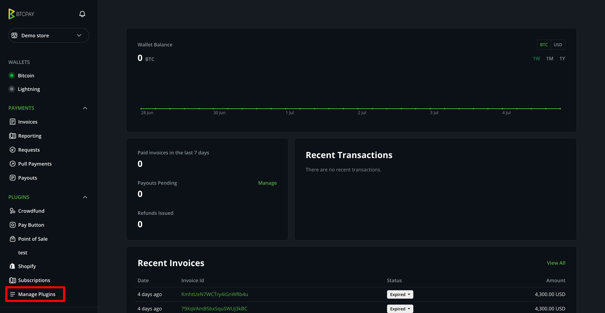
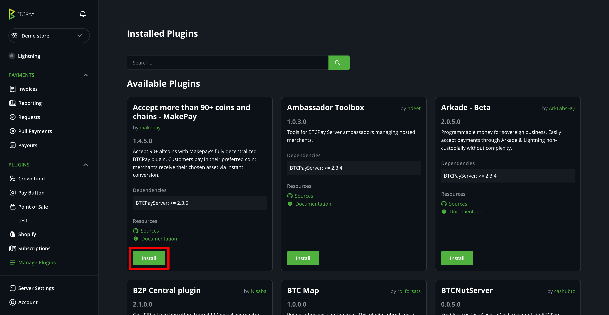
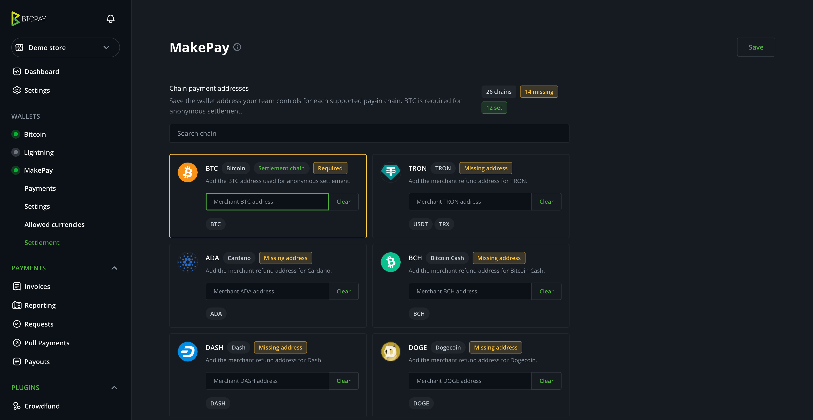

# MakePay

MakePay is a decentralized BTCPay Server payment plugin that adds a native
**Other currencies** payment method to BTCPay checkout. It lets customers pay a
BTCPay invoice with supported coins, tokens, and chains by creating a
decentralized swap through partners such as Chainflip, NEAR, Flashnet, and
others.

The simplest setup does not require a MakePay account. Configure settlement
addresses directly in BTCPay Server, and the plugin creates anonymous one-time
MakePay payment links for each invoice. As an optional fallback, you can connect
a MakePay account with OAuth and use your MakePay company configuration.

## Requirements

- BTCPay Server 2.3.5 or newer.
- A BTCPay store with a BTC on-chain wallet enabled for connected MakePay
  settlement, or saved chain settlement addresses for anonymous mode.
- Server administrator access to install plugins.
- Store administrator access to modify wallet and payment settings.
- A public HTTPS BTCPay Server URL.
- Optional: a MakeCrypto account with access to the MakePay company that should
  process payments, if you want account-managed settings.

Connected MakePay payments settle to BTC on-chain through the BTCPay store
wallet. Anonymous mode uses the settlement routes you save in the plugin's
**Settlement** tab.

## How to Activate

In the BTCPay Server dashboard, open **Manage Plugins** or
**Server Settings > Plugins**, find **MakePay**, install it, and restart BTCPay
Server if prompted.



The plugin is available in the BTCPay Server Plugin Builder directory:

[Open MakePay in BTCPay Plugin Builder](https://plugin-builder.btcpayserver.org/public/plugins/makepay-payments)



After installation, open your BTCPay store. The store wallet navigation should
show a new **MakePay** item with **Payments**, **Settings**,
**Allowed currencies**, and **Settlement** sections.

## Use Cases and Features

- Run without connecting a MakePay account by configuring anonymous settlement
  routes in the plugin.
- Let customers pay BTCPay invoices with MakePay-supported coins, tokens, and
  chains.
- Keep the customer inside the native BTCPay invoice checkout instead of
  redirecting to a separate checkout page.
- Create decentralized swap payments through MakePay partners such as Chainflip,
  NEAR, Flashnet, and others.
- Connect a BTCPay store to MakePay with native OAuth as an optional fallback to
  account-managed settings.
- Settle connected-account payments to a fresh BTC on-chain receive address
  from the BTCPay store wallet for each invoice.
- Choose which MakePay-supported pay-in currencies are available for each
  BTCPay store.
- Use a currency-first checkout picker, then choose the exact network for the
  selected currency.
- Require quote approval, or start the payment immediately after a valid quote.
- Ask customers for a receipt email, or use a default merchant receipt email.
- Use saved MakePay merchant refund wallets, or ask the payer for a refund
  address when the selected pay-in chain requires one.
- View and search MakePay payment sessions, selected assets, deposit addresses,
  transaction IDs, and settlement details from the BTCPay store.
- Verify MakePay webhooks with a store-specific signing secret and reconcile
  pending payments after restarts or missed webhook delivery.

## No-Account Setup

You can start without connecting a MakePay account:

1. Open **Store > Wallets > MakePay > Settings**.
2. Confirm the public **BTCPay Server site URL**.
3. Open **Settlement** and save the settlement addresses you want MakePay to use.
4. Open **Allowed currencies** and choose which pay-in assets customers can use.
5. Return to **Settings**, enable MakePay, and save.

With this setup, each BTCPay invoice creates an anonymous one-time MakePay
payment link. No OAuth tokens or MakePay account connection are required.



## Optional: Connect MakePay Account

Open **Store > Wallets > MakePay > Settings** in BTCPay Server and click
**Connect MakePay**.

The connection flow:

1. Creates a store-specific native OAuth installation.
2. Opens MakeCrypto and asks you to sign in.
3. Lets you choose the MakeCrypto company to connect.
4. Shows the permissions requested by the BTCPay Server plugin.
5. Returns to BTCPay Server after approval.
6. Stores DPoP-bound OAuth tokens and a MakePay webhook signing secret in the
   BTCPay store settings.

The OAuth connection requests these scopes:

```text
company:read
makepay:payment-links:read
makepay:payment-links:write
makepay:settings:read
makepay:settings:write
```

The plugin does not ask for wallet withdrawal permissions.

## Configure Settings

Review **Store > Wallets > MakePay > Settings**.

| Setting                        | What it does                                                                                                                               |
| ------------------------------ | ------------------------------------------------------------------------------------------------------------------------------------------ |
| Enable MakePay                 | Turns the **Other currencies** checkout method on or off.                                                                                  |
| BTCPay Server site URL         | Public HTTPS URL used for MakePay return links and webhook delivery.                                                                       |
| Quote approval                 | Shows an intermediate quote confirmation step before the payment starts. Disable it to start payment immediately after currency selection. |
| Ask customer for receipt email | Asks the payer for a receipt email before payment.                                                                                         |
| Default receipt email          | Used for MakePay receipts when customer email collection is disabled.                                                                      |
| Preferred refund address       | Prefers saved merchant wallets when available, or asks the payer for a refund address when the selected pay-in chain needs one.            |
| Settlement destination         | In anonymous mode, choose the BTCPay Server BTC wallet or a custom saved MakePay route.                                                    |
| Who pays payment fees          | For anonymous mode, choose whether merchant or customer pays service fees.                                                                 |
| Reconciliation thresholds      | For anonymous mode, configure percent/fixed variance and optional merchant surcharge settings sent to MakePay.                             |

For MakePay payments, it is recommended to increase the BTCPay invoice expiry
window. Open **Store > Settings > Payment** and change **Invoice expires if the
full amount has not been paid after ...** from the default **15 minutes** to
**60 minutes**. This gives customers enough time to choose a route, receive a
quote, and complete the decentralized swap payment.

Use **Allowed currencies** to control which MakePay-supported pay-in assets
appear in BTCPay checkout. Leave **Allow all** enabled to make new
MakePay-supported currencies automatically available, or choose a limited list
for that BTCPay store. Checkout requests for quotes or payment starts are also
checked server-side against the invoice's allowed-currency list.

Use **Settlement** to review connected-account settlement information or to save
chain addresses for anonymous mode. In anonymous mode, the saved chain address
book can be used for settlement routes and preferred merchant refund wallets.

If **Preferred refund address** is set to prefer merchant wallets, configure
refund wallets for every pay-in chain you enable. If no merchant refund wallet
exists for the selected chain, checkout falls back to asking the payer for a
refund address.

## Checkout Flow

When a BTCPay invoice is created, the plugin prepares a MakePay payment link for
that invoice:

1. BTCPay calculates the invoice amount and BTC amount due.
2. For connected accounts, the plugin reserves a fresh BTC on-chain receive
   address from the BTCPay store wallet. For anonymous mode, it resolves the
   configured settlement route or falls back to a BTC store wallet address.
3. The plugin creates a MakePay payment link with BTCPay store and invoice
   metadata, a webhook URL, and the resolved settlement/source-address
   information.
4. BTCPay checkout shows **Other currencies** as a payment method next to the
   store's normal BTC payment method.
5. The customer chooses a MakePay-supported pay-in currency and network,
   receives a live quote, and pays from the displayed address or QR code.

The customer stays in the native BTCPay invoice checkout. The plugin uses
MakePay public payment-link APIs for available assets, quotes, payment start,
payment address generation, QR display, status polling, and quote refresh.

## Settlement and Accounting

MakePay session webhooks and reconciliation responses are treated as evidence
that the MakePay payment session completed. The plugin records that evidence as
a **Processing** MakePay payment on the invoice, so BTCPay does not mark the
invoice as settled solely because MakePay reported a completed session.

BTCPay final settlement should be based on independent BTC wallet/on-chain
confirmation for the merchant-controlled settlement address.

| MakePay state                       | BTCPay behavior                                                                |
| ----------------------------------- | ------------------------------------------------------------------------------ |
| `complete`                          | Records a Processing MakePay payment with session and deposit metadata.        |
| `failed`, `expired`, or `cancelled` | Shows the state without recording a settled payment.                           |
| `underpaid`                         | Keeps the prompt unsettled so the invoice can be handled by policy or support. |

Use **Store > Wallets > MakePay > Payments** to search and inspect MakePay
payment sessions. The details page includes the BTCPay invoice, MakePay session,
selected pay-in asset, quoted amount, deposit address, payment request,
transaction IDs, settlement amount, and delivery ID when available.

## Webhooks and Reconciliation

MakePay sends webhooks to the BTCPay plugin endpoint for the store. The plugin
verifies the `x-makepay-signature` header with either the connected store
webhook secret or the anonymous payment-link webhook secret before updating a
BTCPay invoice.

A background listener also checks pending MakePay payment prompts every few
minutes, which helps reconcile payments after BTCPay Server restarts or missed
webhook delivery.

Public checkout API routes are rate-limited with BTCPay Server's public invoice
limiter, validate bounded request fields before proxying to MakePay, and are
available only while the BTCPay invoice is new and unexpired.

## Troubleshooting

If **Other currencies** is not shown on the invoice checkout, confirm that:

- MakePay is enabled for the store, and either connected or configured with
  anonymous settlement routes.
- The BTCPay store has a BTC on-chain wallet enabled, or anonymous settlement
  routes are configured.
- The invoice amount is large enough to create a BTC settlement amount.
- The plugin can reach MakePay from the BTCPay Server host.

If OAuth approval returns an error, disconnect and connect again from the BTCPay
MakePay settings page. Make sure the BTCPay Server URL is public HTTPS and that
the browser is not opening an old approval tab from a previous connection
attempt.

If checkout asks for a refund address even though you selected merchant wallets,
open MakeCrypto payment settings and confirm that a merchant refund wallet is
saved for the selected pay-in chain.

If a currency is missing in checkout, open the **Allowed currencies** tab in
BTCPay and confirm that the asset is enabled. Also confirm the asset is
currently supported by MakePay payment links.

If anonymous payment links cannot be created, open **Settlement** and confirm
that the BTCPay Server site URL and at least one settlement route are saved. If
you use the BTCPay Server settlement destination, the store needs a BTC on-chain
wallet.

If an invoice does not become paid after the customer sends funds, open the
MakePay payments page in BTCPay and check the selected pay-in asset, quoted
amount, deposit address, transaction ID, session status, and settlement amount.
Then check BTCPay Server logs for MakePay webhook signature, invoice matching,
or wallet address errors.

## Source

The public source repository is available at:

[makepay-io/btcpayserver-makepay](https://github.com/makepay-io/btcpayserver-makepay)

## Development

BTCPay plugin builds expect the BTCPay Server source tree as a submodule at:

```text
submodules/btcpayserver
```

Clone and build with:

```bash
git clone --recurse-submodules https://github.com/makepay-io/btcpayserver-makepay.git
cd btcpayserver-makepay
git submodule update --init --recursive
dotnet build BTCPayServer.Plugins.MakePay/BTCPayServer.Plugins.MakePay.csproj
```

The project currently targets BTCPay Server `>= 2.3.5`, matching the live
compatibility floor used for installation testing.

Run the focused test suite with:

```bash
dotnet test BTCPayServer.Plugins.MakePay.Tests/BTCPayServer.Plugins.MakePay.Tests.csproj
```
